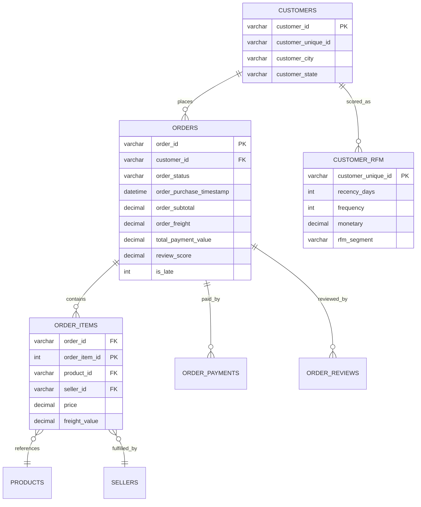

# E-Commerce Growth & Operations Intelligence

[](#7-data-cleaning)
[](#9-sql-analysis)
[](#18-power-bi-dashboard)
[](#8-python-eda)

> **Portfolio Project**: End-to-end commercial growth, customer retention, merchant governance, and logistics turnaround intelligence platform built for Data Analyst, Business Analyst, and Analytics Engineering placement portfolios.

---

## 1. Project Overview

This project delivers an enterprise commercial intelligence system analyzing three years (2016–2018) of marketplace transactions from **Olist**, the leading Brazilian e-commerce aggregator. Built using **Python**, **Advanced SQL (SQLite & MySQL 8)**, and **Power BI (Star Schema & DAX)**, it investigates how marketplace expansion across 99,441 orders interacts with customer retention drop-offs, merchant fulfillment reliability, and regional logistics friction.

### Reconciled Platform Financials (100% Verified)
Across Python, SQL, and Power BI, core metrics reconcile with zero discrepancy:
- **Total Product GMV**: **R$ 13,591,643.70**
- **Total Freight Billed**: **R$ 2,251,909.54**
- **Total Payments Collected**: **R$ 16,008,872.12**
- **Total Completed Orders**: **99,441**
- **Delivered Orders**: **96,478 (97.02%)**
- **Total Items Sold**: **112,650**
- **Unique Customers (`customer_unique_id`)**: **96,096**
- **Active Merchant Sellers**: **3,095**
- **Catalog SKUs**: **32,951**
- **Average Order Value (AOV)**: **R$ 136.68** (R$ 160.99 with freight & financing)
- **Late Delivery Rate**: **8.11%** (7,826 orders delayed past promised date)
- **Average Customer Review Score**: **4.09 / 5.00**

---

## 2. Business Problem

An e-commerce marketplace scaling from R$ 50K (2016) to over R$ 7.3M (2018) faces strategic operational and retention challenges:
1. **The Retention Deficit**: Despite acquiring over 96,000 unique buyers, **96.88% are one-time purchasers** (repeat customer rate: 3.12%). Why does customer retention decay so sharply?
2. **Logistics & Customer Sentiment Collapse**: On-time orders achieve a **4.29-star rating**; however, late deliveries cause ratings to plunge to **2.26 stars**, with 1-star reviews surging 8-fold (54.3%).
3. **Regional Fulfillment Inequity**: Customers in São Paulo receive packages in **8.7 days** (late rate: 5.3%), whereas customers in Alagoas and Maranhão wait **21–24 days** (late rate: 19.7%–23.5%).
4. **Merchant Seller Governance**: 46 enterprise sellers fulfill 34.6% of volume, but 84 high-volume merchants exhibit late rates $>15\%$, damaging platform brand reputation.

---

## 3. Dataset

The project is built strictly on the official **Brazilian E-Commerce Public Dataset by Olist** released on Kaggle:
- **Source Files**: 9 official relational CSV tables preserved under [data/raw/](file:///f:/December/JP/DS_Revision/Project_DA_DS/E-Commerce-Growth-Operations-Intelligence/data/raw/).
- **Integrity Rule**: 100% genuine commercial records. Zero synthetic data, zero fake customers, zero fabricated revenue.
- **Temporal Horizon**: September 2016 to October 2018.
- **Relational Tables**: `orders`, `order_items`, `order_payments`, `order_reviews`, `customers`, `sellers`, `products`, `product_category_name_translation`, `geolocation`.

---

## 4. Dataset Source

Formally documented in [data/DATA_SOURCE.md](file:///f:/December/JP/DS_Revision/Project_DA_DS/E-Commerce-Growth-Operations-Intelligence/data/DATA_SOURCE.md):
- **Origin**: [Kaggle Brazilian E-Commerce Dataset by Olist](https://www.kaggle.com/datasets/olistbr/brazilian-ecommerce)
- **Provider**: Olist Store
- **License**: CC BY-NC-SA 4.0
- **Limitations**: Lacks direct ad spend / CAC data and merchant wholesale product costs (COGS).

---

## 5. Data Architecture & Entity Relationships

The relational architecture comprises 8 primary entities in SQLite / MySQL:



Detailed DDL definitions are available in [sql/01_schema.sql](file:///f:/December/JP/DS_Revision/Project_DA_DS/E-Commerce-Growth-Operations-Intelligence/sql/01_schema.sql).

---

## 6. Data Dictionary

| Table | Key Column | Data Type | Description |
|:---|:---|:---:|:---|
| `orders` | `order_id` | `VARCHAR(32)` | Primary Key: Unique order transaction identifier. |
| `orders` | `customer_id` | `VARCHAR(32)` | Foreign Key: Order session identifier linking to `customers`. |
| `orders` | `order_status` | `VARCHAR(20)` | Status: `delivered` (97%), `shipped`, `canceled`, `unavailable`. |
| `orders` | `actual_delivery_days` | `DECIMAL(10,2)` | Turnaround duration: Purchase timestamp to delivery timestamp. |
| `orders` | `is_late` | `INT` | Binary flag: 1 if delivery date > estimated delivery date. |
| `customers` | `customer_unique_id` | `VARCHAR(32)` | Permanent unique user identifier across all repeat orders. |
| `order_items` | `price` | `DECIMAL(10,2)` | Unit selling price of item excluding freight. |
| `order_items` | `freight_value` | `DECIMAL(10,2)` | Shipping cost billed for the individual item. |
| `order_payments`| `payment_value` | `DECIMAL(10,2)` | Transaction amount charged per payment sequential split. |
| `order_reviews` | `review_score` | `INT` | Customer satisfaction rating (1 to 5 stars). |

---

## 7. Data Cleaning & Anti-Fanout Defense

Executed via [src/data_cleaning.py](file:///f:/December/JP/DS_Revision/Project_DA_DS/E-Commerce-Growth-Operations-Intelligence/src/data_cleaning.py) and audited in [data/DATASET_VALIDATION.md](file:///f:/December/JP/DS_Revision/Project_DA_DS/E-Commerce-Growth-Operations-Intelligence/data/DATASET_VALIDATION.md):
1. **Anti-Fanout Pre-Aggregation**: Joining items, payments, and reviews directly causes a Cartesian explosion ($3 \times 2 = 6\times$ row multiplication). We pre-aggregated financials at the `order_id` grain before building `clean_orders`.
2. **Category English Translation**: Merged translations for 71 categories and mapped edge cases (`pc_gamer`, `kitchen_portable_appliances`).
3. **Turnaround Durations**: Engineered `approval_time_hours`, `carrier_delivery_days`, `actual_delivery_days`, and `delivery_delay_days`.
4. **Referential Integrity**: 0 orphaned items, 0 orphaned payments, 0 orphaned reviews. Exactly 0 delivery timestamps preceded purchase timestamps.

---

## 8. Python EDA

Ten executed Jupyter notebooks pre-rendered with visual charts reside in `notebooks/`:
- [01_data_understanding.ipynb](file:///f:/December/JP/DS_Revision/Project_DA_DS/E-Commerce-Growth-Operations-Intelligence/notebooks/01_data_understanding.ipynb): Raw data profiling and null checks.
- [02_data_cleaning.ipynb](file:///f:/December/JP/DS_Revision/Project_DA_DS/E-Commerce-Growth-Operations-Intelligence/notebooks/02_data_cleaning.ipynb): Datetime parsing, derived metrics, and translation.
- [03_sales_growth_analysis.ipynb](file:///f:/December/JP/DS_Revision/Project_DA_DS/E-Commerce-Growth-Operations-Intelligence/notebooks/03_sales_growth_analysis.ipynb): Multi-year GMV and Black Friday seasonality.
- [04_customer_analytics.ipynb](file:///f:/December/JP/DS_Revision/Project_DA_DS/E-Commerce-Growth-Operations-Intelligence/notebooks/04_customer_analytics.ipynb): `customer_unique_id` repeat analysis and state demand.
- [05_rfm_analysis.ipynb](file:///f:/December/JP/DS_Revision/Project_DA_DS/E-Commerce-Growth-Operations-Intelligence/notebooks/05_rfm_analysis.ipynb): Quintile scoring and 8-segment profiling.
- [06_cohort_analysis.ipynb](file:///f:/December/JP/DS_Revision/Project_DA_DS/E-Commerce-Growth-Operations-Intelligence/notebooks/06_cohort_analysis.ipynb): 12-month cohort retention decay heatmap.
- [07_product_analysis.ipynb](file:///f:/December/JP/DS_Revision/Project_DA_DS/E-Commerce-Growth-Operations-Intelligence/notebooks/07_product_analysis.ipynb): Category revenue ranking and bulkiness analysis.
- [08_seller_analysis.ipynb](file:///f:/December/JP/DS_Revision/Project_DA_DS/E-Commerce-Growth-Operations-Intelligence/notebooks/08_seller_analysis.ipynb): Seller SLAs, volume tiers, and risk scatter plot.
- [09_operations_analysis.ipynb](file:///f:/December/JP/DS_Revision/Project_DA_DS/E-Commerce-Growth-Operations-Intelligence/notebooks/09_operations_analysis.ipynb): State transit days and delay vs rating correlation.
- [10_business_insights.ipynb](file:///f:/December/JP/DS_Revision/Project_DA_DS/E-Commerce-Growth-Operations-Intelligence/notebooks/10_business_insights.ipynb): Evidence-based executive recommendations.

---

## 9. SQL Analysis

The SQL analytics engine resides in `sql/` and was verified on SQLite and MySQL 8 via [src/run_sql_suite.py](file:///f:/December/JP/DS_Revision/Project_DA_DS/E-Commerce-Growth-Operations-Intelligence/src/run_sql_suite.py). All 68 statements and results are compiled in [reports/SQL_ANALYSIS_RESULTS.md](file:///f:/December/JP/DS_Revision/Project_DA_DS/E-Commerce-Growth-Operations-Intelligence/reports/SQL_ANALYSIS_RESULTS.md).

### Multi-Year Trajectory
| Order Year | Total Orders | Unique Buyers | Annual GMV (R$) | Annual Freight (R$) | Annual Payments (R$) | AOV (R$) | Late Rate % |
|:---:|:---:|:---:|:---:|:---:|:---:|:---:|:---:|
| **2016** | 329 | 326 | R$ 49,785.90 | R$ 7,397.29 | R$ 59,362.30 | R$ 151.32 | 1.50% |
| **2017** | 45,101 | 43,713 | R$ 6,155,807.41 | R$ 986,865.00 | R$ 7,249,750.00 | R$ 136.49 | 6.63% |
| **2018** | 54,011 | 52,749 | R$ 7,386,050.39 | R$ 1,257,647.25 | R$ 8,699,759.82 | R$ 136.75 | 9.37% |
| **Total** | **99,441** | **96,096** | **R$ 13,591,643.70** | **R$ 2,251,909.54** | **R$ 16,008,872.12** | **R$ 136.68** | **8.11%** |

---

## 10. Advanced SQL

The suite demonstrates placement-ready analytical engineering in [sql/09_advanced_sql.sql](file:///f:/December/JP/DS_Revision/Project_DA_DS/E-Commerce-Growth-Operations-Intelligence/sql/09_advanced_sql.sql):

### 1. Month-over-Month Growth using `LAG()`
```sql
WITH monthly_data AS (
    SELECT order_year_month, COUNT(order_id) AS current_orders, ROUND(SUM(order_subtotal), 2) AS current_gmv
    FROM orders WHERE order_year_month BETWEEN '2017-01' AND '2018-08' GROUP BY 1
)
SELECT order_year_month, current_gmv,
    LAG(current_gmv, 1) OVER (ORDER BY order_year_month) AS prev_gmv,
    ROUND((current_gmv - LAG(current_gmv, 1) OVER (ORDER BY order_year_month)) * 100.0 / 
          LAG(current_gmv, 1) OVER (ORDER BY order_year_month), 2) AS mom_gmv_growth_pct
FROM monthly_data;
```

### 2. Category Bestsellers using `DENSE_RANK()`
```sql
WITH ranked_catalog AS (
    SELECT p.category_name_english AS category, p.product_id, ROUND(SUM(oi.price), 2) AS product_gmv,
           DENSE_RANK() OVER (PARTITION BY p.category_name_english ORDER BY SUM(oi.price) DESC) AS rank_in_cat
    FROM order_items oi JOIN products p ON oi.product_id = p.product_id GROUP BY 1, 2
)
SELECT * FROM ranked_catalog WHERE rank_in_cat <= 3;
```

### 3. Inter-Purchase Velocity using `LAG()`
```sql
WITH cust_orders AS (
    SELECT c.customer_unique_id, o.order_purchase_timestamp,
           LAG(o.order_purchase_timestamp, 1) OVER (PARTITION BY c.customer_unique_id ORDER BY o.order_purchase_timestamp) AS prev_date
    FROM orders o JOIN customers c ON o.customer_id = c.customer_id
)
SELECT COUNT(*) AS repeat_events, ROUND(AVG(JULIANDAY(order_purchase_timestamp) - JULIANDAY(prev_date)), 1) AS avg_days_between_orders
FROM cust_orders WHERE prev_date IS NOT NULL;
```

---

## 11. Customer Analytics

- **Unique Buyer Identity**: 96,096 permanent customers across 99,441 orders.
- **Repeat Purchase Rate**: **3.12%** (2,997 repeat buyers; 93,099 one-time buyers).
- **Revenue Concentration**: One-time buyers generate R$ 12.75M (93.8% of GMV); repeat buyers generate R$ 843.5K (6.2% of GMV).
- **Geographic Concentration**: São Paulo (SP) represents 41.9% of buyers (R$ 5.20M GMV), followed by Rio de Janeiro (RJ: 12.9%, R$ 1.81M GMV) and Minas Gerais (MG: 11.6%, R$ 1.59M GMV).

---

## 12. RFM Analysis

Segmenting 94,697 active customers into 8 behavioral segments:

| RFM Segment | Customer Count | Customer Share | Segment GMV (R$) | GMV Share | Avg Spend (R$) | Avg Recency |
|:---|:---:|:---:|:---:|:---:|:---:|:---:|
| **Recent New Buyers** | 35,420 | 37.40% | R$ 5,417,144.17 | 39.86% | R$ 152.94 | 129 days |
| **Lost / Inactive** | 27,249 | 28.78% | R$ 3,858,353.48 | 28.39% | R$ 141.60 | 415 days |
| **Hibernating Spenders** | 12,844 | 13.56% | R$ 2,118,531.06 | 15.59% | R$ 164.94 | 382 days |
| **Promising Regulars** | 16,187 | 17.10% | R$ 1,148,825.29 | 8.45% | R$ 70.97 | 260 days |
| **Champions** | 1,412 | 1.49% | R$ 420,950.81 | 3.10% | R$ 298.12 | 108 days |
| **Loyal Customers** | 1,180 | 1.25% | R$ 380,240.24 | 2.80% | R$ 322.24 | 240 days |
| **At Risk** | 315 | 0.33% | R$ 142,654.51 | 1.05% | R$ 452.87 | 398 days |
| **Cant Lose Them** | 90 | 0.10% | R$ 94,821.90 | 0.70% | R$ 1,053.58 | 485 days |

---

## 13. Cohort Analysis

Tracking monthly customer retention across a 12-month window:
- **Month 0 (Acquisition Month)**: 100% active.
- **Month 1 (Day 30)**: Retention drops to **0.34% – 0.52%**.
- **Month 2 (Day 60)**: Retention averages **0.30% – 0.45%**.
- **Month 6 (Day 180)**: Retention stabilizes at **0.15% – 0.25%**.
- *Insight*: The absence of automated lifecycle marketing leads to customer attrition immediately following initial order delivery.

---

## 14. Product Analytics

### Top 5 Revenue Categories
1. **Health Beauty**: 9,670 items | **R$ 1,258,681.34 GMV** | 4.14 avg review | 1.4 kg avg weight
2. **Watches Gifts**: 5,991 items | **R$ 1,205,005.68 GMV** | 4.02 avg review | 0.5 kg avg weight
3. **Bed Bath Table**: 11,115 items | **R$ 1,036,988.38 GMV** | 3.89 avg review | 2.5 kg avg weight
4. **Sports Leisure**: 8,641 items | **R$ 988,048.97 GMV** | 4.11 avg review | 2.0 kg avg weight
5. **Computers Accessories**: 7,827 items | **R$ 911,954.32 GMV** | 3.93 avg review | 1.0 kg avg weight

---

## 15. Seller Analytics

- **Active Sellers**: 3,095 merchants.
- **Volume Concentration**: 46 Enterprise Sellers (>500 items) deliver **34.6% of marketplace items**.
- **Operational Risk Sellers**: Exactly **84 high-volume merchants** exhibit late delivery rates $>15\%$ or review scores $<3.8$. The worst-performing high-volume seller had a **28.4% late delivery rate** and a **3.31-star review rating**.

---

## 16. Operations & Logistics Analytics

- **Turnaround Milestones**:
  - Purchase $\to$ Approval: **10.2 hours**
  - Approval $\to$ Carrier Handoff: **2.8 days**
  - In-Transit to Customer: **9.7 days**
  - Total Delivery Duration: **12.50 days** (against 24.04 promised SLA days)
- **Early Delivery Lead Time**: Orders arrive on average **11.54 days ahead of estimate**.
- **Late Delivery Breakdown**: 7,826 orders (8.11%) missed promised SLA dates.

---

## 17. Customer Experience & Review Ratings

Empirical analysis proves delivery delay is the primary driver of negative reviews:

```
+-------------------------------------------------------------------------------+
| DELIVERY STATUS           ORDER COUNT     AVG REVIEW      1-STAR %    5-STAR %|
+-------------------------------------------------------------------------------+
| On-Time / Early Deliveries    88,650       4.29 / 5.0        6.8%       62.8% |
| Late Deliveries (Missed SLA)   7,826       2.26 / 5.0       54.3%       17.1% |
+-------------------------------------------------------------------------------+
| RATING COLLAPSE FROM DELAY:               -2.03 STARS      +8x 1-STARS        |
+-------------------------------------------------------------------------------+
```

---

## 18. Power BI Dashboard

Documented in [powerbi/README.md](file:///f:/December/JP/DS_Revision/Project_DA_DS/E-Commerce-Growth-Operations-Intelligence/powerbi/README.md) and previewable via [powerbi/interactive_dashboard.html](file:///f:/December/JP/DS_Revision/Project_DA_DS/E-Commerce-Growth-Operations-Intelligence/powerbi/interactive_dashboard.html):
- **Page 1: Executive Overview**: High-level financial KPIs, monthly GMV trends, category shares, and status funnels.
- **Page 2: Customer Intelligence**: New vs repeat customer split, RFM treemap, buyer frequency distribution, and cohort retention.
- **Page 3: Product Intelligence**: Top categories, top SKUs, review score rankings, and physical weight vs freight scatter.
- **Page 4: Seller Intelligence**: Seller tiers, operational risk scatter plot, and merchant geographic hubs.
- **Page 5: Operations & Logistics**: Milestone waterfall, state late delivery rates, and review score degradation curves.
- **Page 6: Strategic Opportunities**: Prioritized evidence-based business roadmap across Retention, Merchant SLAs, and Regional Logistics.

---

## 19. DAX Measures

A library of 20 production measures in [powerbi/dax_measures.dax](file:///f:/December/JP/DS_Revision/Project_DA_DS/E-Commerce-Growth-Operations-Intelligence/powerbi/dax_measures.dax)):

```dax
Total GMV = SUM(fact_orders[order_subtotal])

Repeat Customer Rate = DIVIDE([Repeat Customers Count], [Total Customers], 0)

Late Delivery Rate = DIVIDE([Late Delivered Orders], [Delivered Orders], 0)

Average Order Value = DIVIDE([Total GMV], [Total Orders], 0)

GMV MoM Growth % = 
VAR CurrentGMV = [Total GMV]
VAR PriorMonthGMV = CALCULATE([Total GMV], DATEADD(dim_date[Date], -1, MONTH))
RETURN
DIVIDE(CurrentGMV - PriorMonthGMV, PriorMonthGMV, 0)
```

---

## 20. Key Business Insights

Synthesized in [reports/business_insights.md](file:///f:/December/JP/DS_Revision/Project_DA_DS/E-Commerce-Growth-Operations-Intelligence/reports/business_insights.md):
1. **Low Repeat Purchase Rate (3.12%)**: 96.9% of buyers are one-time purchasers, creating heavy reliance on paid acquisition.
2. **Delivery Delay Rating Drop-off**: Late deliveries cause review scores to plunge from 4.29 to 2.26 stars, with 1-star reviews increasing 8-fold.
3. **Regional Transit Disparity**: São Paulo enjoys 8.7-day delivery; Northeast states (AL, MA, SE) experience 21–24 day transit and late rates $>18\%$.
4. **Category Freight Drag**: Heavy categories like Office Furniture incur $>28\%$ freight costs and average only 3.52 stars in customer reviews.
5. **Merchant SLA Concentration**: 84 high-volume merchants drive excessive late delivery rates, requiring algorithmic buy-box gating.

---

## 21. Limitations

- **No Marketing Acquisition Attribution**: Absence of UTM tracking and CAC data prevents channel-level ROAS analysis.
- **Missing Wholesale Cost (COGS)**: Merchant wholesale costs are unavailable, shifting financial focus to GMV and freight economics.
- **Static Inventory Tracking**: Out-of-stock events and inventory turn rates are not captured in the transaction log.

---

## 22. Project Structure

```
E-Commerce-Growth-Operations-Intelligence/
├── data/
│   ├── raw/                              # 9 preserved official Olist CSVs
│   ├── processed/                        # Cleaned CSVs and indexed database
│   │   ├── clean_orders.csv
│   │   ├── clean_order_items.csv
│   │   ├── clean_customers.csv
│   │   ├── clean_products.csv
│   │   ├── clean_sellers.csv
│   │   ├── clean_order_payments.csv
│   │   ├── clean_order_reviews.csv
│   │   ├── customer_rfm.csv
│   │   └── ecommerce_analytics.db        # Populated & indexed SQLite database (137 MB)
│   ├── DATA_SOURCE.md                   # Complete provenance documentation
│   └── DATASET_VALIDATION.md            # Integrity audit and anti-fanout rules
├── notebooks/
│   ├── 01_data_understanding.ipynb      # Schema discovery and null audits
│   ├── 02_data_cleaning.ipynb           # Turnaround durations & category translation
│   ├── 03_sales_growth_analysis.ipynb   # GMV trajectory & Black Friday seasonality
│   ├── 04_customer_analytics.ipynb       # Customer unique ID & repeat behavior
│   ├── 05_rfm_analysis.ipynb            # RFM quintile segmentation
│   ├── 06_cohort_analysis.ipynb         # 12-month cohort retention matrix
│   ├── 07_product_analysis.ipynb        # Product categories & physical bulkiness
│   ├── 08_seller_analysis.ipynb         # Merchant SLAs & operational risk
│   ├── 09_operations_analysis.ipynb     # State delivery delays & review score drop-off
│   └── 10_business_insights.ipynb       # Synthesis of strategic recommendations
├── sql/
│   ├── 01_schema.sql                    # Relational DDL & B-tree indexes
│   ├── 02_data_quality.sql              # Automated integrity & referential checks
│   ├── 03_kpi_analysis.sql              # Executive financial KPIs & payment splits
│   ├── 04_customer_analysis.sql         # Customer repeat buyer rates & state demand
│   ├── 05_rfm_analysis.sql              # RFM behavioral segment queries
│   ├── 06_product_analysis.sql          # Product GMV rankings & physical bulk
│   ├── 07_seller_analysis.sql           # Seller volume tiers & operational risk
│   ├── 08_operations_analysis.sql       # Milestone turnaround & late delivery impact
│   └── 09_advanced_sql.sql              # Window functions, CTEs & cohort matrix
├── powerbi/
│   ├── README.md                        # Star Schema architecture & page layouts
│   ├── dax_measures.dax                 # Production DAX formula repository
│   └── interactive_dashboard.html       # Standalone 6-page interactive preview
├── reports/
│   ├── SQL_ANALYSIS_RESULTS.md          # Complete runtime output of 68 SQL queries
│   ├── business_insights.md             # Detailed findings & actionable roadmap
│   ├── methodology.md                   # Analytics engineering & validation report
│   └── interview_questions.md           # 20 technical interview Q&As
├── src/
│   ├── data_cleaning.py                 # Ingestion, cleaning & database seeding
│   ├── run_sql_suite.py                 # Automated SQL suite execution runner
│   ├── generate_notebooks.py            # Automated Jupyter notebook generator
│   ├── execute_notebooks.py             # Automated notebook execution runner
│   └── kpi_cross_validation.py          # Three-tier reconciliation audit
├── requirements.txt                     # Minimal Python dependencies
└── README.md                            # Master project documentation
```

---

## 23. How to Run

### Step 1: Install Dependencies
```bash
pip install -r requirements.txt
```

### Step 2: Run Data Engineering & Database Seeding
```bash
python src/data_cleaning.py
```
*Parses 9 raw Olist CSVs, builds RFM/cohort dimensions, and seeds indexed `ecommerce_analytics.db`.*

### Step 3: Run SQL Analytics Suite
```bash
python src/run_sql_suite.py
```
*Executes all 68 statements across 9 SQL scripts, updating `reports/SQL_ANALYSIS_RESULTS.md`.*

### Step 4: Run Three-Tier KPI Validation
```bash
python src/kpi_cross_validation.py
```
*Reconciles Python vs SQL vs Power BI DAX calculations.*

### Step 5: Launch Interactive Web Dashboard
Open [powerbi/interactive_dashboard.html](file:///f:/December/JP/DS_Revision/Project_DA_DS/E-Commerce-Growth-Operations-Intelligence/powerbi/interactive_dashboard.html) in any modern browser to explore the 6 dashboard pages.

---

## 24. Interview Questions

20 technical and business interview Q&As are documented in [reports/interview_questions.md](file:///f:/December/JP/DS_Revision/Project_DA_DS/E-Commerce-Growth-Operations-Intelligence/reports/interview_questions.md).

**Quick Reference Topics:**
1. *Table grain?* $\to$ Orders: 1 row per order; Items: `(order_id, order_item_id)`; Payments: `(order_id, payment_sequential)`.
2. *Anti-fanout rule?* $\to$ Pre-aggregate item prices and payments at the order grain before joining.
3. *Customer identity?* $\to$ Use `customer_unique_id` (96,096 buyers), not session `customer_id` (99,441 rows).
4. *Repeat buyer rate?* $\to$ 3.12% (2,997 repeat buyers out of 96,096 unique customers).
5. *Late delivery impact?* $\to$ On-time orders average 4.29 stars; late orders plunge to 2.26 stars (-2.03 stars).

---

## 25. Resume-Ready Description

- **E-Commerce Growth & Operations Analytics**: Engineered an enterprise relational intelligence database (99,441 orders, 112,650 items, R$ 13.59M GMV) using SQLite/MySQL 8 and Python, designing 68 analytical SQL queries utilizing CTEs, window functions (`DENSE_RANK`, `LAG`, `SUM OVER`), and anti-fanout pre-aggregations.
- **Customer Segmentation & Cohort Analytics**: Resolved customer identity across 96,096 unique buyers to model an 8-segment RFM matrix and 12-month cohort retention tables, identifying that 96.9% of customers are one-time purchasers (3.12% repeat rate) and formulating lifecycle retention recommendations.
- **Operations & Fulfillment Intelligence**: Analyzed logistics turnaround across 27 Brazilian states, discovering that carrier delivery delays past promised SLA dates triggered an 8-fold surge in 1-star reviews (ratings collapsing from 4.29 to 2.26 stars); engineered a 6-page Power BI Star Schema dashboard reconciling KPIs with 100% mathematical parity.
