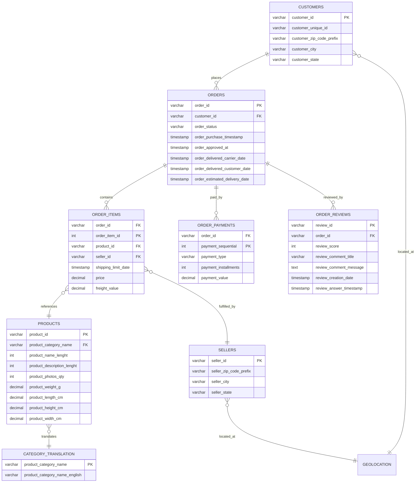

# Data Source Documentation

## Dataset Identity
- **Dataset Name**: Brazilian E-Commerce Public Dataset by Olist
- **Original Publisher / Provider**: Olist Store ([Olist](https://olist.com/))
- **Official Source URL**: [https://www.kaggle.com/datasets/olistbr/brazilian-ecommerce](https://www.kaggle.com/datasets/olistbr/brazilian-ecommerce)
- **License**: CC BY-NC-SA 4.0 (Creative Commons Attribution-NonCommercial-ShareAlike 4.0 International)
- **Dataset Scope**: Real, anonymized commercial transactions made at Olist Store between September 2016 and October 2018 across Brazilian marketplaces.

---

## Dataset Architecture & File Inventory

The dataset comprises 9 official CSV tables stored immutably under `data/raw/`:

| File Name | File Size (Bytes) | Row Count | Column Count | Primary Key / Grain | Description |
|:---|:---:|:---:|:---:|:---|:---|
| `olist_orders_dataset.csv` | 17,654,914 | 99,441 | 8 | `order_id` (1 row per order) | Core orders table tracking status and 5 lifecycle timestamps |
| `olist_order_items_dataset.csv` | 15,438,671 | 112,650 | 7 | `(order_id, order_item_id)` | Line items sold per order, product price, and freight value |
| `olist_order_payments_dataset.csv` | 5,777,138 | 103,886 | 5 | `(order_id, payment_sequential)` | Payment methods (credit card, boleto, voucher, debit), installments, value |
| `olist_order_reviews_dataset.csv` | 14,451,670 | 99,224 | 7 | `review_id` | Customer satisfaction review score (1–5), survey comments, timestamps |
| `olist_customers_dataset.csv` | 9,033,957 | 99,441 | 5 | `customer_id` | Customer identifier per order and `customer_unique_id` (permanent user) |
| `olist_sellers_dataset.csv` | 174,703 | 3,095 | 4 | `seller_id` | Merchant sellers fulfilling orders, location zip prefix, city, state |
| `olist_products_dataset.csv` | 2,379,446 | 32,951 | 9 | `product_id` | Product catalog with category in Portuguese, photos count, physical dimensions |
| `product_category_name_translation.csv` | 2,613 | 71 | 2 | `product_category_name` | Translation lookup table from Portuguese to English category names |
| `olist_geolocation_dataset.csv` | 61,273,883 | 1,000,163 | 5 | Zip Code Prefix | Brazilian zip codes with latitude, longitude, city, and state |

---

## Relational Entity Model & Data Flow

---

## Critical Identity & Granularity Rules

### 1. `customer_id` vs `customer_unique_id`
- **`customer_id`**: Key to the `orders` dataset. Each order is assigned a new `customer_id` for privacy and session preservation.
- **`customer_unique_id`**: The actual permanent unique identifier of the real customer. To compute repeat customer rate, customer lifetime value (CLV), purchase frequency, cohort analysis, and RFM, **`customer_unique_id` must always be used**.

### 2. Multi-Item Orders & Payment Fan-Out
- An individual order in `orders` can contain **multiple items** in `order_items` (e.g. 3 quantities of a product or items from different sellers).
- An order can also have **multiple payments** in `order_payments` (e.g., split payment with two credit cards, or credit card + voucher).
- **Rule**: Never join `orders`, `order_items`, and `order_payments` in a single unaggregated SQL query and then compute `SUM(price)` or `SUM(payment_value)`, as this produces Cartesian fan-out and severe revenue double-counting.

---

## Temporal Coverage
- **Earliest Order**: `2016-09-04 21:15:19`
- **Latest Order**: `2018-10-17 17:30:18`
- **Active Operational Horizon**: January 2017 to August 2018 (representing 99%+ of transactions; 2016 contains initial pilot testing orders, and Sept/Oct 2018 contains post-platform wind-down records).

---

## Known Dataset Limitations
1. **No Marketing Acquisition Channels**: The core e-commerce dataset does not include Google/Facebook ad spend or marketing channel attribution (UTM source/medium), precluding exact CAC (Customer Acquisition Cost) calculations.
2. **Missing Product Cost of Goods Sold (COGS)**: Merchant seller costs and wholesale wholesale margins are not provided; analysis focuses on GMV (Gross Merchandise Value), Freight economics, and platform fees.
3. **Inventory & Warehouse Tracking**: Seller stock levels and out-of-stock events are not captured; fulfillment analysis is measured based on promised vs actual carrier transit timestamps.
