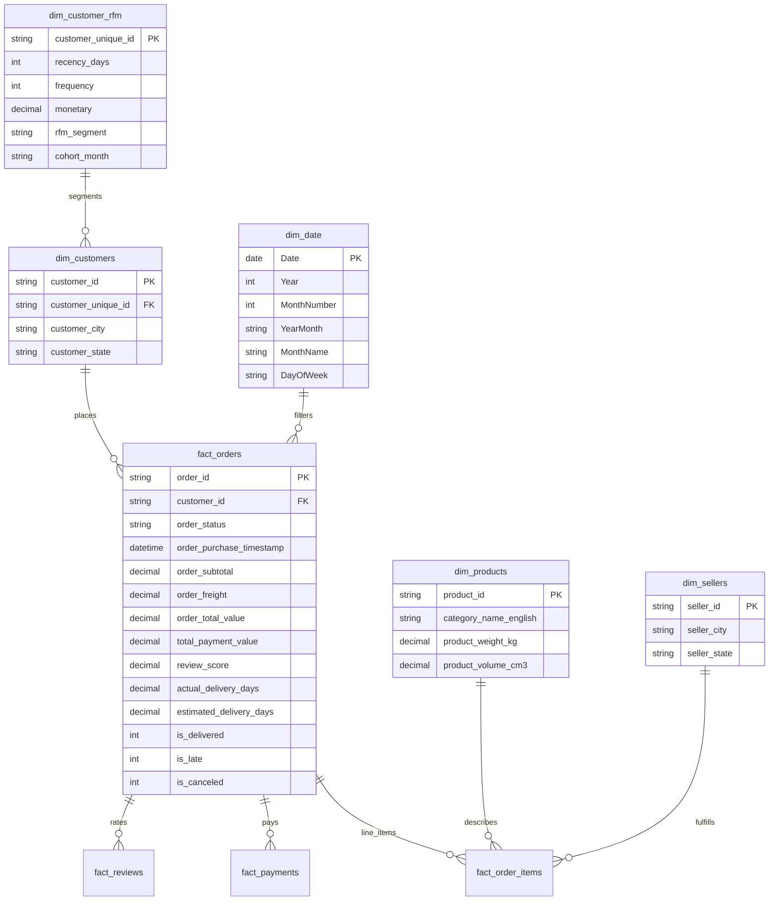

# Power BI Architecture & Dashboard Implementation Guide

**Project**: E-Commerce Growth & Operations Intelligence  
**Dataset**: Brazilian E-Commerce Public Dataset by Olist (99,441 orders, 112,650 order items)  
**File Reference**: `Ecommerce_Growth_Operations.pbix`  
**Web Interactive Preview**: [`powerbi/interactive_dashboard.html`](file:///f:/December/JP/DS_Revision/Project_DA_DS/E-Commerce-Growth-Operations-Intelligence/powerbi/interactive_dashboard.html)

---

## 1. Dimensional Architecture: The Star Schema

To avoid bidirectional filtering ambiguities, high memory footprints, and Cartesian join fan-out, the analytical model adheres to a clean **Star Schema**:

---

## 2. Table Granularity & Anti-Fanout Defense

| Table Name | Granularity | Role | Fan-Out Prevention Strategy |
|:---|:---|:---:|:---|
| `fact_orders` | 1 row per order (`order_id`) | Fact | Pre-aggregated totals (`order_subtotal`, `order_freight`, `payment_value`, `review_score`) eliminate duplicate row multiplication. |
| `dim_customers` | 1 row per customer order session | Dimension | Bridges session `customer_id` to permanent `customer_unique_id`. |
| `dim_customer_rfm` | 1 row per permanent user | Dimension | Contains customer-level RFM scores and lifetime monetary metrics. |
| `dim_products` | 1 row per SKU (`product_id`) | Dimension | Translated English category taxonomy and physical dimensions. |
| `dim_sellers` | 1 row per merchant (`seller_id`) | Dimension | Seller location, city, state. |
| `dim_date` | 1 row per calendar day | Dimension | Continuous calendar spanning `2016-09-01` to `2018-10-31` for DAX time intelligence (`SAMEPERIODLASTYEAR`, `DATEADD`). |

---

## 3. Dashboard Structure & Page Specifications

### Page 1: Executive Overview
- **Header KPI Cards**:
  - `Total GMV`: **R$ 13.59M**
  - `Total Orders`: **99,441**
  - `Unique Customers`: **96,096**
  - `Average Order Value`: **R$ 136.68**
  - `Late Delivery Rate`: **8.11%**
  - `Average Review Score`: **4.09 / 5.00**
- **Visuals**:
  1. *Monthly GMV & Order Velocity Trend (2017–2018)*: Dual-axis clustered column (GMV) and line (Orders) highlighting the November 2017 Black Friday inflection peak.
  2. *Top 5 Product Categories by GMV Contribution*: Horizontal bar chart highlighting Bed Bath Table, Health Beauty, and Sports Leisure.
  3. *Geographic Revenue Concentration Map / Bar*: Customer state breakdown (SP, RJ, MG generating >65% of revenue).
  4. *Order Status Funnel*: Delivered (97.0%), Shipped (1.1%), Canceled (0.6%), Invoiced/Unavailable.
- **Global Slicers**: `Order Date Range`, `Customer State`, `Product Category`, `Order Status`.

---

### Page 2: Customer Intelligence & Retention
- **Header KPI Cards**:
  - `Total Unique Buyers`: **96,096**
  - `Repeat Buyers Count`: **2,997**
  - `Repeat Customer Rate`: **3.12%**
  - `Average Orders per Customer`: **1.03**
- **Visuals**:
  1. *RFM Customer Segment Distribution*: Treemap showing customer count and GMV share across the 8 behavioral segments (Champions, Loyal Customers, At Risk, Hibernating, etc.).
  2. *Customer Frequency Cohorts*: Donut chart of One-Time Buyers (96.9%) vs Repeat Buyers (3.1%).
  3. *Customer Cohort Retention Heatmap*: Matrix displaying Month 0 to Month 12 retention decay for 2017 cohorts.
  4. *Customer Lifetime Spend Distribution*: Histogram / binned distribution of spend per customer.

---

### Page 3: Product & Category Intelligence
- **Header KPI Cards**:
  - `Catalog Products Count`: **32,951**
  - `Total Items Sold`: **112,650**
  - `Average Item Price`: **R$ 120.65**
  - `Average Freight per Item`: **R$ 19.99**
- **Visuals**:
  1. *Top 10 Categories by GMV vs Volume*: Grouped bar chart comparing revenue vs physical unit throughput.
  2. *Top 10 Individual SKUs*: Ranked table with units sold, GMV, and product review ratings.
  3. *Category Satisfaction Scorecard*: Diverging bar chart of categories with highest reviews (Computers, Books) vs lowest reviews (Security Services, Office Furniture).
  4. *Product Weight & Freight Impact*: Scatter plot comparing product weight (kg) vs freight ratio (%) and delivery duration.

---

### Page 4: Seller Intelligence & Governance
- **Header KPI Cards**:
  - `Active Sellers`: **3,095**
  - `Top 10 Sellers GMV Share`: **11.4%**
  - `Average Seller GMV`: **R$ 4,391.48**
- **Visuals**:
  1. *Seller Volume Tiers*: Clustered column chart (Boutique, Emerging, Established, High-Volume, Enterprise Anchor).
  2. *Seller Operational Risk Matrix*: Scatter plot of Late Delivery Rate (%) vs Average Review Score with threshold reference lines (Late Delivery > 15%, Review < 3.8).
  3. *Top 10 Sellers by Revenue*: Table with seller ID, city, state, GMV, and fulfillment review score.
  4. *Seller Origin Geographic Distribution*: State map showing high merchant concentration in São Paulo (SP).

---

### Page 5: Operations & Logistics Turnaround
- **Header KPI Cards**:
  - `Average Delivery Days`: **12.50 days**
  - `Average Estimated Days`: **24.04 days**
  - `Early Delivery Lead Time`: **11.54 days ahead of estimate**
  - `Late Delivery Rate`: **8.11% (7,827 orders)**
- **Visuals**:
  1. *Fulfillment Milestone Flow*: Waterfall chart displaying Purchase $\to$ Approval (10.2 hrs) $\to$ Carrier Handoff (2.8 days) $\to$ Final Delivery (9.7 days).
  2. *Late Delivery Rate by Customer State*: Horizontal bar chart ranking states from lowest delays (SP: 5.3%) to highest delays (AL: 23.4%, MA: 19.7%).
  3. *Review Rating Drop-off vs Delivery Delay Severity*: Line chart showing average rating dropping from 4.29 stars for on-time deliveries to 1.62 stars for deliveries delayed $>15$ days.
  4. *Carrier Transit Duration Boxplot / Distribution*: Distribution of transit days across logistics carriers.

---

### Page 6: Business Opportunities & Strategic Roadmap
- **Evidence-Based Strategic Panels**:
  - **Panel A: Automated Post-Purchase Customer Retention**:
    - *Metric*: Repeat buyer rate is currently 3.12%.
    - *Action*: Trigger automated win-back workflows at Day 30 and Day 60 tailored to the customer's initial product category.
  - **Panel B: Seller SLA Enforcement & Fulfillment Badges**:
    - *Metric*: High-risk sellers with $>15\%$ late delivery rate drive a disproportionate share of 1-star reviews.
    - *Action*: Restrict buy-box visibility for chronic late shippers and award "Top Reliable Seller" badges to merchants with $<3\%$ late delivery.
  - **Panel C: Northeast Regional Fulfillment Hubs**:
    - *Metric*: Southeast (SP/PR/RJ) enjoys sub-10 day delivery; Northern states (AL, MA, PA, RR) exceed 22–28 days.
    - *Action*: Establish regional drop-shipping consolidation hubs in Salvador (BA) and Recife (PE) to cut interstate line-haul transit times.
