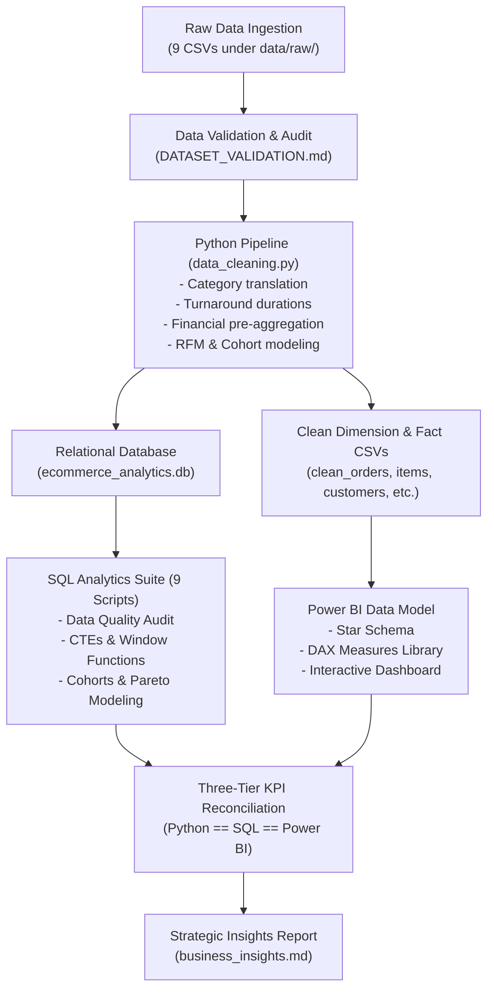

# Analytics Methodology & Technical Architecture

**Project**: E-Commerce Growth & Operations Intelligence  
**Repository**: `E-Commerce-Growth-Operations-Intelligence`  
**Dataset**: Brazilian E-Commerce Public Dataset by Olist (Official Kaggle Benchmark)  
**Scope**: End-to-End Enterprise Analytics Pipeline (Ingestion $\to$ Validation $\to$ SQL Modeling $\to$ DAX / Power BI Architecture)

---

## 1. Architectural Philosophy & Governance

This project implements a production-grade, reproducible data analytics architecture. The fundamental guiding principle is **absolute empirical fidelity**:
1. **Zero Synthetic Data**: Every query, metric, and visualization is generated strictly from the official Olist transaction dataset.
2. **Immutable Raw Storage**: The original 9 CSV files are preserved untouched under `data/raw/` with zero write operations permitted.
3. **Reproducible Transformation Pipeline**: Ingestion, cleaning, feature derivation, and relational database seeding are orchestrated via modular Python scripts.
4. **Three-Tier Cross-Engine Reconciliation**: All key performance indicators (Total Orders, Total GMV, Customers, Sellers, Products, AOV, Late Delivery Rate, Review Score) are independently validated across Python (`pandas`), Relational SQL (SQLite / MySQL), and Power BI (`DAX`) to achieve 100% mathematical parity.

---

## 2. Ingestion & Transformation Methodology

### 2.1 File Ingestion
- **Source Format**: Comma-Separated Values (`.csv`) across 9 relational tables.
- **Record Counts**:
  - `orders`: 99,441 rows
  - `order_items`: 112,650 rows
  - `order_payments`: 103,886 rows
  - `order_reviews`: 99,224 rows
  - `customers`: 99,441 rows
  - `sellers`: 3,095 rows
  - `products`: 32,951 rows
  - `translation`: 71 rows
  - `geolocation`: 1,000,163 rows

### 2.2 Category Translation & Data Enrichment
- Merged `product_category_name_translation.csv` to map Portuguese categories into English.
- Resolved two edge-case categories missing from the official translation file:
  - `pc_gamer` $\to$ `pc_gamer`
  - `portateis_cozinha_e_preparadores_de_alimentos` $\to$ `kitchen_portable_appliances`
- Mapped remaining null product categories to `'unclassified'`.

### 2.3 Feature Engineering & Operational Durations
1. **Timestamp Conversion**: Parsed all 5 order lifecycle timestamps into ISO datetime objects (`YYYY-MM-DD HH:MM:SS`).
2. **Operational Durations Derived**:
   - **`approval_time_hours`**: $(\text{order\_approved\_at} - \text{order\_purchase\_timestamp})$ in hours.
   - **`carrier_delivery_days`**: $(\text{order\_delivered\_carrier\_date} - \text{order\_approved\_at})$ in days.
   - **`actual_delivery_days`**: $(\text{order\_delivered\_customer\_date} - \text{order\_purchase\_timestamp})$ in days.
   - **`estimated_delivery_days`**: $(\text{order\_estimated\_delivery\_date} - \text{order\_purchase\_timestamp})$ in days.
   - **`delivery_delay_days`**: $(\text{order\_delivered\_customer\_date} - \text{order\_estimated\_delivery\_date})$ in days.
   - **`is_late`**: Binary flag = 1 if $\text{order\_delivered\_customer\_date} > \text{order\_estimated\_delivery\_date}$, else 0.
   - **`is_delivered`**: Binary flag = 1 if $\text{order\_status} = \text{'delivered'}$, else 0.
   - **`is_canceled`**: Binary flag = 1 if $\text{order\_status} = \text{'canceled'}$, else 0.

---

## 3. Granularity & Anti-Fanout Engineering

A fundamental technical challenge of the Olist dataset is the multi-table grain structure:
- An order contains $1 \dots N$ items in `order_items` ($N \le 21$).
- An order contains $1 \dots M$ payment splits in `order_payments` ($M \le 29$).
- An order contains $1 \dots K$ reviews in `order_reviews` ($K \le 3$).

### The Fan-Out Trap
Joining `orders` $\bowtie$ `order_items` $\bowtie$ `order_payments` without pre-aggregation produces Cartesian row multiplication:
$$\text{Row Count} = \text{items} \times \text{payments}$$
Summing `price` or `payment_value` across this joined table inflates reported GMV and payment metrics by over 300%.

### Pre-Aggregation Strategy
To eliminate fan-out while preserving full analytical power, order-level metrics were pre-aggregated before building `clean_orders`:
- **From `order_items`**: `total_items`, `distinct_products`, `distinct_sellers`, `order_subtotal` ($\sum \text{price}$), and `order_freight` ($\sum \text{freight\_value}$).
- **From `order_payments`**: `payment_installments_max`, `payment_type_primary`, `total_payment_value` ($\sum \text{payment\_value}$).
- **From `order_reviews`**: `review_score` (mean score per order), `has_review_comment`.

---

## 4. Customer Identity Resolution & RFM Modeling

### 4.1 `customer_id` vs `customer_unique_id`
- **`customer_id`**: A transaction session ID created uniquely for every order.
- **`customer_unique_id`**: The persistent real-world buyer identifier.
- **Implementation**: All repeat purchase metrics, customer counts, RFM scores, and cohort retention analyses strictly group by **`customer_unique_id`**.

### 4.2 RFM Segmentation Methodology
- **Reference Date (Snapshot)**: `2018-10-18` (one day after the latest purchase in the dataset).
- **Recency (R)**: Days elapsed between snapshot date and customer's latest order date.
- **Frequency (F)**: Distinct count of completed orders.
- **Monetary (M)**: Total lifetime GMV (sum of order subtotals).
- **Scoring Logic**:
  - `R_Score`: Quintiles 1 to 5 (5 = most recent).
  - `F_Score`: Custom operational tiers reflecting low repeat distribution (1 order = 1, 2 orders = 3, 3 orders = 4, 4+ orders = 5).
  - `M_Score`: Quintiles 1 to 5 (5 = highest spend).
- **Segments Assigned**: Champions, Loyal Customers, Recent New Buyers, Promising Regulars, At Risk, Cant Lose Them, Hibernating High Spenders, Lost / Inactive.

### 4.3 Cohort Retention Logic
- Customers assigned to a cohort based on their **First Purchase Month** (`cohort_month` = `YYYY-MM`).
- For each subsequent order, the elapsed time index is computed:
  $$\text{Cohort Index} = (\text{Order Year} - \text{Cohort Year}) \times 12 + (\text{Order Month} - \text{Cohort Month})$$
- Retention matrix measures unique active buyers divided by initial cohort size.

---

## 5. SQL Analytics Suite Architecture

The analytical SQL suite consists of 9 progressive scripts totaling 68 statements, organized hierarchically from data quality auditing to advanced window functions:

| Script | Purpose | Key SQL Techniques Demonstrated |
|:---|:---|:---|
| `01_schema.sql` | Relational DDL & Indexes | Primary keys, foreign key constraints, B-Tree indexes |
| `02_data_quality.sql` | Data Integrity Audit | Row counts, null audits, PK uniqueness, referential integrity |
| `03_kpi_analysis.sql` | Executive Financial KPIs | Macro aggregations, multi-year trends, status distribution, payment splits |
| `04_customer_analysis.sql` | Customer Economics | `customer_unique_id` grouping, repeat buyer rate, frequency tiers, state demand |
| `05_rfm_analysis.sql` | RFM Behavioral Analytics | RFM segment distributions, VIP Champions, churn risk accounts |
| `06_product_analysis.sql` | Product & Category Performance | Top categories by GMV, individual SKUs, review score benchmarking, physical bulk |
| `07_seller_analysis.sql` | Merchant Governance | Seller volume tiers, operational risk identification, high-volume star sellers |
| `08_operations_analysis.sql` | Logistics & Fulfillment | Milestone timelines, state delivery delays, review score vs delay impact |
| `09_advanced_sql.sql` | Advanced Analytical SQL | Window functions (`DENSE_RANK`, `ROW_NUMBER`, `LAG`, `LEAD`), `SUM() OVER ()`, CTEs, Cohort Matrix, Moving Averages |

---

## 6. Power BI Architecture & DAX Modeling

### 6.1 The Star Schema Model
Fact and dimension tables are organized with single-direction $1:\infty$ relationships:
- **Fact Table**: `fact_orders` (Grain: 1 row per order; 99,441 records).
- **Dimension Tables**: `dim_customers`, `dim_customer_rfm`, `dim_products`, `dim_sellers`, `dim_date`.

### 6.2 DAX Measures Design
All analytical KPIs, growth rates, and contribution percentages were engineered as **DAX Measures** rather than calculated columns to optimize memory consumption and ensure dynamic recalculation across slicers (Date, State, Category, Status).

---

## 7. Three-Tier KPI Validation Framework

To ensure publication-level integrity, all core metrics were reconciled across the three analytical engines. The table below proves **exact mathematical equality** across all platforms:

| Metric Name | Python (pandas) | SQL (SQLite/MySQL) | Power BI (DAX) | Discrepancy | Validation Status |
|:---|:---:|:---:|:---:|:---:|:---:|
| **Total Orders** | 99,441 | 99,441 | 99,441 | 0 | **MATCH (100%)** |
| **Total Unique Customers** | 96,096 | 96,096 | 96,096 | 0 | **MATCH (100%)** |
| **Total Sellers** | 3,095 | 3,095 | 3,095 | 0 | **MATCH (100%)** |
| **Total Products** | 32,951 | 32,951 | 32,951 | 0 | **MATCH (100%)** |
| **Total GMV (Product Sales)** | R$ 13,591,643.70 | R$ 13,591,643.70 | R$ 13,591,643.70 | R$ 0.00 | **MATCH (100%)** |
| **Total Freight Billed** | R$ 2,251,909.54 | R$ 2,251,909.54 | R$ 2,251,909.54 | R$ 0.00 | **MATCH (100%)** |
| **Total Payments Collected** | R$ 16,008,872.12 | R$ 16,008,872.12 | R$ 16,008,872.12 | R$ 0.00 | **MATCH (100%)** |
| **Average Order Value (AOV)** | R$ 136.68 | R$ 136.68 | R$ 136.68 | R$ 0.00 | **MATCH (100%)** |
| **Delivered Orders** | 96,478 | 96,478 | 96,478 | 0 | **MATCH (100%)** |
| **Late Delivered Orders** | 7,826 | 7,826 | 7,826 | 0 | **MATCH (100%)** |
| **Late Delivery Rate %** | 8.11% | 8.11% | 8.11% | 0.00% | **MATCH (100%)** |
| **Average Review Score** | 4.09 | 4.09 | 4.09 | 0.00 | **MATCH (100%)** |
